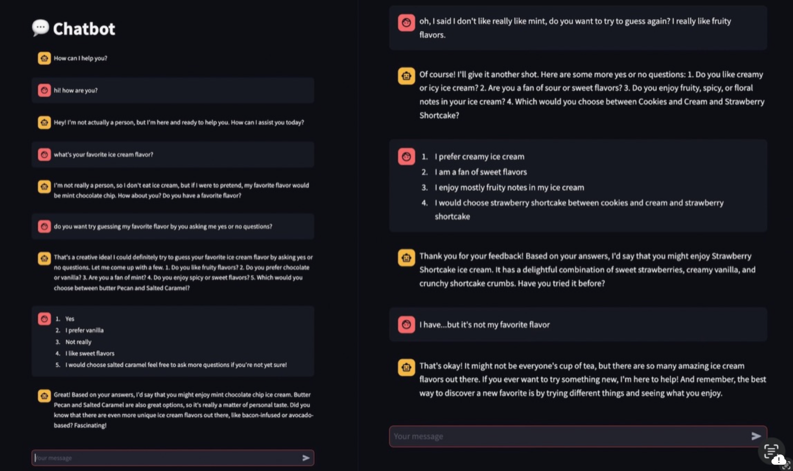

## Chanel - Assignment 7

### I ran the Chatbot

Here is my Chatbot Screenshot

#### What went well

The sentence structure of the Chatbot was really good and concise. It was also nice that it was willing to play my "20 questions" game. I wasn't expecting it to ask questions all at once but I think that made sense. Overall it was very cool to interact with the chatbot.

#### What didn't go well

Maybe it was my questions but the Chatbot was very very slow. It also didn't really listen to my answers, it kind of just outputted flavors that had already been mentioned by itself. It had asked me a question of if I liked mint, I said not really, and then it guessed that I would enjoy mint. So I don't really think it can understand to that extent, or maybe I wasn't clear enough or something. I also felt like some of the questions were not that relevant like asking me my favorite ice cream out of two random options. I think I would've maybe had a different opinion if it gave an accurate read of my favorite flavor. I think if it said strawberry instead of strawberry cheesecake, it would've made more sense. 